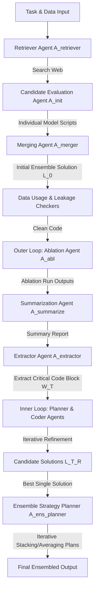

# MLE-STAR: Machine Learning Engineering Agent via Search and Targeted Refinement

This document provides a comprehensive summary and deep dive into the **MLE-STAR** paper: *MLE-STAR: Machine Learning Engineering Agent via Search and Targeted Refinement* (published July 2025, by Google Cloud and KAIST). 

Given that your project aims to implement and refine an automated MLE pipeline for the **AOI (Automated Optical Inspection) Stereo Inspection** task, understanding the core architectural concepts of MLE-STAR is highly valuable.

---

## 1. Executive Summary & Core Insights

Existing Machine Learning Engineering (MLE) agents (such as AIDE or DS-Agent) suffer from two primary bottlenecks:
1. **Bias toward familiar methods (LLM-inherent knowledge):** LLMs tend to generate standard, familiar code (e.g., simple Logistic Regression or outdated models like ResNet) instead of task-specific, state-of-the-art architectures (e.g., EfficientNet, Vision Transformers, or specialized tabular packages).
2. **Coarse exploration strategies:** Existing agents typically modify the *entire code structure at once* in each iteration. This often causes the agent to jump prematurely between pipeline steps (e.g., moving to hyperparameter tuning before fully exploring feature engineering options).

**MLE-STAR** solves these limitations by combining:
* **Web Search as a Tool:** Retrieving actual state-of-the-art models and code examples dynamically from the web rather than relying on static model knowledge or manually curated case banks.
* **Targeted Code Block Refinement via Ablation:** Automatically running ablation studies to identify which specific component of the ML pipeline (e.g., scaling, imputation, feature engineering) has the biggest impact on performance, then focusing search efforts (via nested loops) exclusively on refining that block.
* **Evolutionary/Dynamic Ensembling:** Running parallel pipelines under different seeds and letting the LLM autonomously propose and refine complex ensemble plans (like stacking or optimized weighted averages) rather than relying on simple voting.

### Key Performance Impact
On **MLE-bench Lite** (22 diverse Kaggle competitions), MLE-STAR achieves:
* Medals in **64%** of the competitions when paired with `gemini-2.5-pro` (significantly outperforming all alternatives).
* Medals in **43.9%** when paired with `gemini-2.0-flash` (compared to just 25.8% for AIDE under the same model).
* Substantially higher **Gold Medal** rates (**36.4%** with Gemini 2.5 Pro) due to its specialized targeted refinement.

---

## 2. Multi-Agent System Architecture

MLE-STAR is structured as a multi-agent framework comprising several specialized agents working in concert. 

### The Specialized Agents:
1. **Retriever Agent ($A_{retriever}$):** Takes the task description and queries a search engine to locate $P$ highly effective models and clean, concise code examples.
2. **Candidate Evaluation Agent ($A_{init}$):** Generates simple, self-contained scripts to train and evaluate each retrieved model individually on a subset of the data (subsampled to 30k rows for speed).
3. **Merging Agent ($A_{merger}$):** Sequentially integrates the high-performing candidates (sorted by validation score) into a consolidated ensemble script ($L_0$), checking if the average ensemble improves the validation score.
4. **Ablation Agent ($A_{abl}$):** Generates a script that systematically modifies or disables individual components (e.g., disables scaling, removes one-hot encoding) to run a parallel ablation study.
5. **Summarization Agent ($A_{summarize}$):** Cleans up noisy logs and parses execution tracebacks/outputs to produce a highly concise ablation summary.
6. **Extractor Agent ($A_{extractor}$):** Analyzes the ablation summary to isolate the exact text block $W_T$ representing the pipeline component with the largest performance variance.
7. **Planner Agent ($A_{planner}$):** Suggests 3-5 natural language strategies to refine the extracted code block based on previous refinement histories and scores.
8. **Coding Agent ($A_{coder}$):** Implements the natural language refinement plan directly on the extracted code block $W_T$ without touching the rest of the script.
9. **Ensemble Planner ($A_{ens\_planner}$):** Focuses on combining final solutions from parallel pipelines, suggesting advanced blending, grid search weights, or meta-learning stacking architectures.
10. **Ensembler Agent ($A_{ensembler}$):** Assembles the parallel codes into a single execution script according to the ensembling plan.
11. **Data Leakage ($A_{leakage}$) & Data Usage ($A_{data}$) Checkers:** Code guards that scan scripts before execution to eliminate leakage and force the usage of all relevant input data files.
12. **Debugging Agent ($A_{debugger}$):** Monitors runtimes and intercepts code crashes, feeding traceback logs back to the LLM to auto-correct syntax or package errors.

---

## 3. Core Mechanisms & Pipelines

### Phase A: Smart Initialization
Instead of starting from a generic baseline script, MLE-STAR builds a high-quality initial solution:
1. **Search:** $A_{retriever}$ runs search-as-a-tool to find $P$ specific models and code snippets.
2. **Individual Evaluation:** Simple single-file scripts are created and run. A string marker `'Final Validation Performance: {score}'` is printed to let the system parse performance automatically.
3. **Iterative Ensemble Merge:** Starting with the best model, the agent attempts to merge the next-best model code. If the validation performance increases, the merge is accepted; if it degrades, the merging stops.

### Phase B: Nested Refinement Loop (The Core Engine)
To iteratively improve the initial solution $L_0$, MLE-STAR runs a nested loop:
* **Outer Loop (Target Identification):**
  * Runs a multi-branch ablation study.
  * Extractor Agent ($A_{extractor}$) looks at the performance drops from each branch. For example, if disabling *StandardScaler* reduces score by 0.01, but disabling *OneHotEncoder* reduces score by 0.03, the encoder block is identified as having the largest impact.
  * It isolates the exact character-sequence corresponding to that encoder block.
* **Inner Loop (Deep Exploration):**
  * The agent executes $Y$ iterations of the planner-coder cycle *exclusively* on the isolated block.
  * The planner is fed the history of attempted plans and validation scores, encouraging it to try highly diverse approaches (e.g., target encoding, binning, interaction features).
  * Once the inner loop completes, the best-performing block is permanently swapped back into the main pipeline. The outer loop then proceeds to the next high-impact block (excluding previously modified blocks to prevent local minima).

### Phase C: Evolutionary/Self-Refining Ensembling
When combining $b$ parallel final solutions, MLE-STAR goes beyond simple voting or basic averaging. The agent runs a dedicated optimization loop:
1. **Ensemble Planning:** The agent suggests an ensembling strategy (e.g., "let's train a Logistic Regression meta-learner using predicted probabilities from Model A and Model B").
2. **Implementation & Validation:** $A_{ensembler}$ integrates the parallel solution codes and tests the ensembled validation score.
3. **Feedback Optimization:** Over $d$ rounds, the planner refines the ensembling strategies based on validation scores (e.g., optimizing grid search weights, adjusting threshold boundaries).

---

## 4. Operational Guards: Leakage and Data Checkers

One of the most impressive aspects of the MLE-STAR design is its awareness of standard LLM failure modes in machine learning engineering:

### Data Leakage Checker ($A_{leakage}$)
* **The Problem:** LLMs frequently introduce data leakage by fitting transformers (like Scalers or Imputers) on the concatenated training + testing/validation datasets. They also occasionally use the validation/test target labels inside feature engineering scripts.
* **The Solution:** $A_{leakage}$ extracts the preprocessing code block $W_{data}$ and analyzes it. If leakage is present, it forces a rewrite that strictly extracts statistics (like median or mean) from the training split and applies them to validation/test sets without refitting.
* **Impact:** In the *Spaceship Titanic* competition, running without the leakage checker showed an inflated validation score (0.8677) but a collapsed test score (0.7343). Enabling $A_{leakage}$ successfully aligned validation (0.8188) and test scores (0.8033).

### Data Usage Checker ($A_{data}$)
* **The Problem:** When provided with multi-modal or multi-file datasets (e.g., a main `train.csv` and secondary volumetric/spatial data in individual `.xyz` files), standard LLMs often take the path of least resistance and ignore the secondary data.
* **The Solution:** $A_{data}$ compares the loaded files in the initial script $L_0$ against the full task description $T_{task}$. If secondary files are unused, it revises the script to parse and incorporate the auxiliary features.
* **Impact:** In the *Nomad2018* competition, incorporating the `.xyz` geometry files using $A_{data}$ reduced the RMSLE from **0.0591** to **0.0559**.

---

## 5. Direct Relevance to Your AOI Stereo Inspection Project

You are currently working on an automated ML engineering agent for the **AOI Stereo Inspection** task. The concepts in the MLE-STAR paper map directly to several tasks in your pipeline:

1. **Ablation Studies for Feature Extraction:**
   * In stereo inspection, features are extracted from left and right images (e.g., pixel intensity, structural similarity, SSIM, alignment shifts). 
   * You can use MLE-STAR's ablation strategy to target *specifically* which features (left, right, or stereo differential features) have the most significant impact on your F1/Recall metrics, and focus the code optimization specifically on the feature extractor block.
2. **Data Usage Checking for Multi-View Data:**
   * Since this is a **stereo** task, it is easy for a basic LLM agent to only load the left image or treat them as a single concatenated flat array.
   * Implementing a **Data Usage Checker** ensures that both views (Left/Right image pairs) and the Excel-based labels are fully and correctly utilized.
3. **Data Leakage Guarding in Image Pipelines:**
   * Standard image augmentation (like resizing, normalization, or contrast adjustment) can easily introduce subtle leakages if applied globally. 
   * A leakage check verifies that all transforms and image normalizations use parameters computed solely from the training set.
4. **Adaptive Ensembling:**
   * Binary inspection demands ultra-high Recall (near 100%) and very low Overkill/Miss rates. 
   * Relying on a single model (like a basic CNN or ResNet) can fail. MLE-STAR's approach of ensembling different architectures (e.g., a LightGBM on tabular metadata + an EfficientNet on image pairs) through an LLM-designed meta-learner is ideal for meeting your strict industrial performance thresholds.
