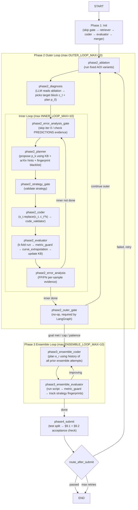

# Build AOI MLE-STAR Agent with LangGraph

Build a LangGraph-based agent that implements the MLE-STAR iterative optimization loop for the AOI Binary Inspection task. The agent takes a dataset of stereo inspection images (L/R BMP pairs with Excel labels) and a goal (NG recall ≥ 1.0, miss rate = 0%, overkill ≤ 5%), then autonomously trains, evaluates, diagnoses, and refines models until the goal is met.

> **Source spec**: [AOI_Binary_Inspection_Task_Specification.pdf](file:///Users/yishinn/Downloads/LangGraph%20AOI/AOI_Binary_Inspection_Task_Specification.pdf)
> **Reference paper**: [MLE-STAR-paper.pdf](file:///Users/yishinn/Downloads/LangGraph%20AOI/MLE-STAR-paper.pdf)
> **ADK reference implementation**: `~/Downloads/AOI agent /mle_star_agent/`

---

## User Review Required

> [!IMPORTANT]
> **LLM Provider**: The plan uses DeepSeek via LiteLLM (same as the ADK version). Should we keep DeepSeek or switch to a different provider (e.g., OpenAI, Anthropic, Gemini)?

> [!IMPORTANT]
> **Scope of first build**: This plan covers the full agent. Should we build all 4 phases at once, or start with Phase 1 + Phase 2 only, then extend?

> [!WARNING]
> **Dataset location**: The dataset is symlinked from `AOI agent /[SUP046]...` lot folders. These contain stereo L/R BMP images + `.xlsx` label sheets. Confirm the symlinks are accessible from your Python environment.

## Open Questions

> [!IMPORTANT]
> **Checkpointing backend**: Use SQLite (persistent across crashes) or in-memory (simpler, dev-only)? SQLite is strongly recommended — training scripts take 45-60 min each and the ADK version lost progress without persistence.

> [!NOTE]
> **Web search for retriever**: ADK uses Tavily → Serper → DuckDuckGo fallback (keyless). Keep this, or start from a fixed baseline? Retriever is what finds current architectures (EfficientNet, ViT) instead of defaulting to outdated ones.

---

## Architecture Overview



---

## Component 1 — Shared Utilities

Port the shared modules from the ADK reference. These are pure Python (no ADK dependency).

#### [MODIFY] [state.py](file:///Users/yishinn/Downloads/LangGraph%20AOI/mle_star_agent/state.py) — ✅ done
- `Annotated[list, operator.add]` reducers on `candidate_scripts`, `candidate_scores`, `tried_approaches` — append-only. Nodes that must not append (e.g. skip-checks loading from disk) return nothing for these keys.
- **Counter names**: `outer_iteration` / `inner_iteration` / `ensemble_iteration` everywhere. Never `outer_loop` / `inner_loop`.
- **Canonical metric keys**: `ng_recall`, `miss_rate`, `overkill_rate`, `accuracy`, `f1` — exact keys from `metrics_parser.py` and `acceptance_scoring.py`. Never `overkill` / `acc` short forms.
- All phase fields: `data_split`, `current_best_score`, `best_miss_rate`, `best_overkill_rate`, `best_accuracy`, `best_f1`, `best_candidate_name`, `no_improve_count`, `stop_outer_loop`, `debug_mode`, `ablation_results`, `target_component`, `target_block_code`, `diagnosis`, `error_analysis`, `refinement_plan`, `ensemble_script`, `ensemble_models`, etc.
- `ensemble_models` has **no reducer** (replace-semantics: each ensemble iteration defines its own complete member set).
- `tokens_used` is the canonical token-budget field. Never copy ADK's `token_count`.

#### [MODIFY] [config.py](file:///Users/yishinn/Downloads/LangGraph%20AOI/mle_star_agent/config.py) — ✅ done
- Lazy API-key check via `require_api_key()` — importing config must not raise without a key.
- `NO_IMPROVE_MAX = 2` (patience once final §9.2 met) + `NO_IMPROVE_MAX_CONSTRAINED = 5` (patience once relaxed §9.1 met).
- `DEBUG_MODE` from env `DRY_RUN=1` + `DEBUG_CHECK_TIMEOUT_SECONDS = 120`. Maps to ADK's `debug_mode` (1 epoch, 10 samples, short timeout).
- `BOARD_CODE_PATTERN = r"VHB[A-Z0-9]+"` + `BOARD_CODE_STRIP_SUFFIX_DIGITS = 2` — needed by `data_split.py`.
- `CKPT_L0` — the L0 baseline checkpoint that Phase 1 skip-gate restores from.
- **Model names** (match ADK config exactly):
  - `MODEL_FLASH = "deepseek/deepseek-v4-flash"` — thinking disabled; used for evaluators, gates, bookkeeping
  - `MODEL_PRO = "deepseek/deepseek-v4-pro"` — extended thinking enabled, `budget_tokens=16000`, `reasoning_effort="max"`; used for coders, diagnosis, planning
- `TOKEN_BUDGET = 10_000_000` (10M tokens). `TOKEN_LITE_THRESHOLD = 7_000_000` — switch from PRO to FLASH above this.
- All §9.1/§9.2 thresholds, loop caps, threshold-sweep settings match ADK exactly.

#### [NEW] `mle_star_agent/shared/checkpoint_io.py` — ✅ ported
- **Checkpoint authority**: LangGraph SQLite owns graph state (counters, phase, metrics). JSON files (`CKPT_*`) own heavy artifacts only (generated scripts, data split, `.pth` weights). The two layers must never own the same field.

#### [NEW] `mle_star_agent/shared/acceptance_scoring.py` — ✅ ported
- `passes_relaxed_acceptance`, `passes_final_acceptance`, `acceptance_distance`, `is_acceptance_improvement` — full weighted distance + tie-breaking logic from ADK.

#### [NEW] `mle_star_agent/shared/code_runner.py`
- Port from ADK — subprocess executor with configurable timeout.
- Must honour `DEBUG_MODE`: cap to 1 epoch / 10 samples / `DEBUG_CHECK_TIMEOUT_SECONDS` when set.
- Returns `{stdout, stderr, returncode}` for metric parsing.

#### [NEW] `mle_star_agent/shared/metrics_parser.py`
- Port from ADK — parses `ng_recall`, `miss_rate`, `overkill_rate`, `accuracy`, `f1` from script stdout.
- Also parses `PREDICTIONS` per-sample blocks (needed by `error_analysis_node`) and `CALIBRATION_STATS`.
- `REQUIRED_GENERATED_SCRIPT_MARKERS` — the set of output strings every generated script must print (used by the code validator).

#### [NEW] `mle_star_agent/shared/metric_guard.py` ⚠️
- **Correctness-relevant, not just quality.** Called on every metric parse path in ADK. Guards against degenerate outputs: flat class probabilities, near-zero splits, missing required markers. Without it, a crashed/flat training run parses as real metrics and corrupts every downstream routing decision.
- Port from ADK `shared/metric_guard.py`.

#### [NEW] `mle_star_agent/shared/data_split.py`
- Port from ADK — grouped board-level train/val/test split using `BOARD_CODE_PATTERN`.
- Board groups are never split across partitions — no data leakage between boards.

#### [NEW] `mle_star_agent/shared/labels.py`
- Port from ADK — reads `.xlsx` label sheets, maps raw labels to canonical G/NG using `FAIL_LABELS` / `PASS_LABELS` from config.

#### [NEW] `mle_star_agent/shared/llm.py`
- LLM call wrapper: constructs prompts, calls DeepSeek via LiteLLM, parses structured JSON responses, tracks token usage against `TOKEN_BUDGET`, switches to `MODEL_FLASH` once `TOKEN_LITE_THRESHOLD` is exceeded.
- **Absorbs ADK `shared/callbacks.py`**: rate-limit retry with exponential backoff (`rate_limit_retry_callback`), per-call token counting (`count_tokens_callback`), budget-stop guard (`budget_stop_callback` — raises if `tokens_used >= TOKEN_BUDGET`). In ADK these were ADK-specific agent callbacks; in LangGraph they fold into the LLM call wrapper since there is no equivalent callback hook.

#### [NEW] `mle_star_agent/shared/aoi_smoke_triage.py`
- Port from ADK `shared/aoi_smoke_triage.py`. Called by **both Phase 1 candidate evaluator and Phase 2 evaluator** — not optional.
- Parses raw script stdout into a structured smoke diagnostics dict: detects missing required output markers, degenerate probability distributions (all predictions near 0.5), zero-sample val/test splits, missing `PREDICTIONS` block.
- Output feeds directly into `metric_guard` to decide whether to accept or reject a metric parse result.

---

## Component 2 — Code Validator Guard

#### [NEW] `mle_star_agent/guards/code_validator.py`

Port from ADK `guards/code_validator_agent.py`. In LangGraph this is a plain callable function, not an ADK agent.

**What it actually does** (not just "checks format"):
1. Injects dry-run env vars: `DRY_RUN=1`, `DRY_RUN_EPOCHS=1`, `DRY_RUN_SAMPLES=10`, seeds.
2. **Runs the script** via `code_runner` with `_VALIDATOR_TIMEOUT=120s`. A script that errors, hangs, or produces no output is rejected here — not after a 60-min training run.
3. Checks the **dry-run ternary contract**: `epochs = DRY_RUN_EPOCHS if DRY_RUN else N` must be present. Scripts that don't honour `DRY_RUN` will time out the validator.
4. Runs static checks: `data_usage_validator` (both L+R images loaded), `lr_schedule_validator` (`scheduler.step()` present), `difference_feature_validator` (stereo difference features correct), `small_data_strategy_validator` (no known-failed strategy fingerprints).
5. Checks required metric output markers from `REQUIRED_GENERATED_SCRIPT_MARKERS`.
6. **Validation cache**: scripts are hashed (SHA-256); identical scripts skip re-validation. Cache is persisted to `CKPT_VALIDATION_CACHE`.

Returns `{valid: bool, rejection_reasons: list[str]}`. Calling nodes must not execute a script that fails validation.

---

## Component 3 — Phase 1: Initialization

#### [NEW] `mle_star_agent/nodes/phase1_init.py`

A single LangGraph node with internal sequential logic mirroring ADK's 5-agent `SequentialAgent`.

**Step 1 — Skip check**
Check `CKPT_CANDIDATE_SCORES` + `CKPT_L0`. If both exist, load `L0.json` and restore the full best-snapshot into state (`current_best_score`, `best_miss_rate`, `best_overkill_rate`, `best_accuracy`, `best_f1`, `best_candidate_name`), then return early. Without this restoration, Phase 2 starts with empty best-state on crash-resume.

**Step 2 — Data split** (`ensure_data_split_fn`)
Load lot folders → read `.xlsx` labels via `labels.py` → `data_split.py` grouped board split → save to `CKPT_DATA_SPLIT`.

**Step 3 — Retriever**
Web search (Tavily → Serper → DuckDuckGo keyless fallback) for **M=4** candidate model architectures suited to stereo AOI binary inspection. Returns `{model_name, description, example_code}` pairs. Falls back to LLM knowledge of current (2024–25) small-data backbones if all search methods fail — never defaults to legacy ResNet18 only.

**Step 4 — Baseline coder**
For each of the M candidates, LLM generates a complete PyTorch training script using that architecture with stereo L+R image fusion. Passes each through `code_validator` before running.

**Step 5 — Candidate evaluator**
Runs all M scripts via `code_runner` with `aoi_smoke_triage`. Parses metrics with `metric_guard`. **Permanently bans failed architectures** by adding them to `HARD_EXCLUDED_ARCHITECTURES` so they are never generated again (across retries). Returns scored `{name, script, metrics, architecture}` sorted best-first.

**Step 6 — Merger**
Takes the top candidate as `s_0`. For each remaining candidate (best-first), LLM generates a merged script integrating the candidate into `s_0` as a simple ensemble. If the merged version improves the score, it becomes the new `s_0`. Stops when no merge improves.

**Step 7 — Save L0**
Write consolidated best pipeline to `CKPT_L0` (includes script + all 6 best-snapshot fields). Write candidate scores to `CKPT_CANDIDATE_SCORES`.

Returns: `{data_split, candidate_scripts, candidate_scores, current_best_score, best_miss_rate, best_overkill_rate, best_accuracy, best_f1, best_candidate_name, best_pipeline_script}`

> **Design note**: ADK ran these as 5 separate sub-agents. LangGraph consolidates into one node. A mid-Phase-1 crash re-runs from the top (including the retriever search) since LangGraph checkpoints at node boundaries, not within a node. Acceptable granularity regression for v1.

---

## Component 4 — Phase 2: Refinement (Nested Loops)

### `phase2_ablation` node

**Does not ask the LLM to guess what's wrong.** Runs `NUM_ABLATION_VARIANTS` **fixed AOI-specific ablation variants** defined in `ablation_agent.ABLATION_VARIANTS`. Each variant is a named dict specifying what to disable or change. Current set (6 variants):

| Variant name | What it disables / changes |
|---|---|
| `no_stereo_fusion` | Use only L image; drop all R image loading and fusion code |
| `no_weighted_loss` | Replace class-weighted cross-entropy with standard unweighted |
| `no_threshold_sweep` | Fix threshold at 0.5 instead of sweeping on validation set |
| `no_augmentation` | Remove all augmentation; apply only basic normalisation/resize |
| `threshold_acceptance_distance` | Replace recall-only threshold selection with joint acceptance-distance minimisation (miss_rate P0, overkill P1) |
| `fp_penalty_loss` | Explicitly penalise false positives on G samples in loss/sampler |

Each variant runs as its own sub-agent (`_make_variant_step_agent`) with its own checkpoint (`ablation_variant_N.json`). Partially-completed ablations can be resumed. `NUM_ABLATION_VARIANTS = len(ABLATION_VARIANTS)` is exported and used by `RetryLoopAgent` when resetting state on retry.

Previous ablation summaries are passed as context so outer iterations target different components. Parses delta metrics per variant, produces `ablation_results` ranked by impact. Saves to `ckpt_diagnosis(outer_iteration)`. **Also sets `stop_outer_loop = True`** when patience/cap exit conditions are met — it is the outer loop's exit signal source, not just a data producer.

Returns: `{ablation_results, target_component, stop_outer_loop}`

---

### `phase2_diagnosis` node

Has a **checkpoint gate with lineage checking** — if `diagnosis_N.json` exists and ablation inputs haven't changed (SHA-256 of `ablation_results`), loads directly without re-running the LLM. Recomputes if lineage mismatches or ablation ranking is empty.

LLM reads ablation summary + current error patterns → identifies the target code block `c_t` that has the greatest impact and has not been recently targeted. Also generates the initial refinement plan `p_0` for the inner loop (paper §3.2 Eq. 6).

Returns: `{diagnosis_report, target_component, target_block_code, refinement_plan: p_0}`

---

### `phase2_error_analysis_gate` node

**Not a simple "skip on iteration 0."** Full logic:

- **Iteration 0**: skip (no evaluation has run yet). Set `inner_iteration = 0`.
- **Subsequent iterations**: check if the last script emitted `PREDICTIONS` per-sample output (parsed by `metrics_parser`).
  - If yes → proceed to planner with evidence.
  - If no → **first time**: set `error_analysis_instrumentation_required = True` and allow one repair iteration. The coder will be told it MUST emit `PREDICTIONS` output.
  - If no → **second time** (repair already attempted, still no evidence): `escalate` — block the inner loop. "Blind refinement" (refining without knowing what failed) is explicitly prevented.

Returns: `{error_analysis_gate_result}` or escalates.

---

### `phase2_error_analysis` node

Parses `PREDICTIONS` per-sample FP/FN blocks from the last script's stdout. Computes:
- FP count, FN count
- Probability distribution summary (where in [0,1] the false positives cluster)
- Sample-capped `fp_samples` / `fn_samples` lists (capped at `ERROR_ANALYSIS_SAMPLE_CAP`)

Saves to `ckpt_error_analysis(outer_iteration, inner_iteration)`. Lineage-checked against the last script run.

Returns: `{error_analysis_report, latest_error_analysis}`

---

### `phase2_planner` node

Inputs to the LLM prompt (loaded on-demand, not from conversation history):
- Target code block `c_t`
- All previous `{plan, score}` attempts within this outer step
- Error analysis per-sample evidence
- `kb_semantic` — top-K semantically similar records from the **persistent cross-run knowledge base** (what worked / failed in past runs on similar failure modes)
- `KNOWN_FAILED_STRATEGY_FINGERPRINTS` — static blacklist of strategies known to fail for small-data stereo AOI
- `retrieved_technique_hints` — if stagnation was detected by evaluator, fresh arXiv search results for the current failure mode (see `ideator_agent` below)

Proposes next plan `p_k`. Outputs go through `strategy_gate_agent` for validation against the fingerprint blacklist and small-data constraints.

Returns: `{refinement_plan: p_k, tried_approaches: [new_entry]}`

---

### `phase2_coder` node

Uses **load-on-demand pattern** (`include_contents="none"` equivalent) — explicitly loads into the current LLM call:
- Full best pipeline script (from state or `CKPT_BEST_PIPELINE` disk fallback)
- `diagnosis_report`, `error_analysis_report`, chosen strategy `p_k`
- Per-sample FP/FN evidence (capped at `ERROR_ANALYSIS_SAMPLE_CAP`)
- Population summary of all refinement attempts (metrics-only, no full scripts)

LLM implements `p_k` as a refined code block `c_t^k`. The full candidate is formed by surgical replacement: `s_t^k = s_t.replace(c_t, c_t^k)` — only the target block changes, not the whole script.

Passes the result through `code_validator` (runs in dry-run, checks all sub-validators, checks cache). If validation fails, the node either requests a fix or returns the rejection reasons.

Returns: `{candidate_scripts: [s_t^k]}`

---

### `phase2_evaluator` node

1. **Validation cache check** — if this script SHA-256 was already validated + run, load cached result directly.
2. **Run** via `code_runner` with full timeout (or `DEBUG_CHECK_TIMEOUT_SECONDS` if `DEBUG_MODE`).
3. **Curve extrapolation early abort** — if per-epoch loss logs are emitted, `curve_extrapolation.project_power_law` forecasts final performance. If the forecast is clearly below current best, abort without waiting for all epochs.
4. **Metric parsing** — `metrics_parser.parse_metrics` → `metric_guard` validation. If metrics are degenerate (flat probabilities, zero splits), reject and do not update best.
5. **Acceptance comparison** — `is_acceptance_improvement(new, current)` using weighted distance.
6. **Update best** if improved: write `CKPT_BEST_PIPELINE`, update `best_*` snapshot fields.
7. **Persistent KB update** — append a record to `kb_semantic` (tags, target_component, mechanism_class, outcome) so future planner calls can rank similar attempts.
8. **Stagnation / ideation trigger** — if `no_improve_count` exceeds threshold, call `ideator_agent.trigger_ideation`: queries arXiv for fresh technique hints keyed to the diagnosed failure mode (`full_freeze_underfit`, `low_capacity_miss`, `g_ng_overlap`, `threshold_collapse`, `preprocessing_lot_shift`, `near_acceptance`). Populates `retrieved_technique_hints` for the next planner call.
9. **Patience / exit logic** — increments `inner_iteration`. Checks `INNER_LOOP_MAX`. Checks patience caps against `no_improve_count` + acceptance tier. Sets `stop_outer_loop = True` if outer exit conditions are met.

Returns: `{latest_metrics, inner_iteration, no_improve_count, best_pipeline_script, best_*snapshot, stop_outer_loop, candidate_scores: [new_score]}`

---

### Graph topology for Phase 2

```python
# Outer-loop entry
g.add_edge("phase2_ablation", "phase2_diagnosis")
g.add_edge("phase2_diagnosis", "phase2_error_analysis_gate")  # gate handles iter-0 skip

# Inner loop
g.add_edge("phase2_error_analysis_gate", "phase2_planner")
g.add_edge("phase2_planner", "phase2_strategy_gate")
g.add_edge("phase2_strategy_gate", "phase2_coder")
g.add_edge("phase2_coder", "phase2_evaluator")
g.add_edge("phase2_evaluator", "phase2_error_analysis")
# route_inner_loop: "continue" → phase2_error_analysis_gate | "exit" → phase2_outer_gate
g.add_conditional_edges("phase2_error_analysis", route_inner_loop,
                        {"continue": "phase2_error_analysis_gate",
                         "exit": "phase2_outer_gate"})

# Outer gate — must be a registered node; conditional edges cannot originate from a name
g.add_node("phase2_outer_gate", lambda s: s)
# route_outer_loop: "continue" → phase2_ablation | "exit" → phase3_ensemble_coder
g.add_conditional_edges("phase2_outer_gate", route_outer_loop,
                        {"continue": "phase2_ablation",
                         "exit": "phase3_ensemble_coder"})
```

`route_inner_loop` checks: `inner_iteration >= INNER_LOOP_MAX` | `error_analysis_blocked` | early-stop signal from evaluator.
`route_outer_loop` checks: `stop_outer_loop` | `outer_iteration >= OUTER_LOOP_MAX` | `no_improve_count >= NO_IMPROVE_MAX` (final) | `no_improve_count >= NO_IMPROVE_MAX_CONSTRAINED` (relaxed) | `tokens_used >= TOKEN_BUDGET`.

---

## Component 5 — Phase 3: Ensemble

### `phase3_ensemble_coder` node

Uses **load-on-demand** — explicitly loads into the LLM call:
- Full best pipeline script
- Phase 1 candidate scores summary (metrics only, no scripts)
- Ablation results + diagnosis report (context for what failed in Phase 2)
- Calibration stats (probability distribution of the current best model)
- History of all `tried_ensemble_approaches` with strategy fingerprints

For iteration 0: propose a simple baseline strategy `e_0` (e.g. average final predictions from all candidate models). For subsequent iterations: propose the next strategy `e_r` based on the full history of `{strategy, score}` pairs. Each `e_r` is implemented as a standalone Python script that loads and combines all L solution models.

Passes through `code_validator` (dry-run run, sub-validators, cache).

Returns: `{ensemble_script, ensemble_strategy: {strategy_name, combination_method, strategy_fingerprint}}`

---

### `phase3_ensemble_evaluator` node

1. Check validation cache.
2. Run ensemble script via `code_runner`.
3. Parse metrics with `metric_guard`.
4. Compare with `is_acceptance_improvement`.
5. Update best if improved.
6. **Track `tried_ensemble_approaches`** with strategy fingerprints — persisted to `CKPT_TRIED_ENSEMBLE_APPROACHES`. Prevents proposing identical combination methods in future iterations.
7. Increment `ensemble_iteration`. Exit if `ensemble_iteration >= ENSEMBLE_LOOP_MAX` or no improvement pattern detected.

Returns: `{ensemble_models, latest_metrics, ensemble_iteration, tried_ensemble_approaches}`

---

## Component 6 — Phase 4: Submission

### `phase4_submit` node

1. **Lineage check** — if `submission.json` exists and pipeline script SHA-256 matches, load directly.
2. Run final best pipeline on held-out **test split** (not val).
3. Parse metrics with `metric_guard`.
4. Check both acceptance tiers: relaxed §9.1 and final §9.2.
5. Save `CKPT_SUBMISSION` with metrics, threshold, and acceptance result.
6. Set `submission_passed = True/False`.

`route_after_submit`: if `submission_passed` → `END`. If `submission_retry < SUBMISSION_RETRY_MAX` → restart from `phase2_ablation`. If max retries exhausted → `END`.

**On retry, the graph must replicate ADK `RetryLoopAgent._reset_for_retry` behaviour:**
- Archive Phase 2/3/4 checkpoints to `checkpoints/retry_archives/attempt_N/` (move, not delete)
- Reset all loop-state counters: `outer_iteration`, `inner_iteration`, `ensemble_iteration`, `no_improve_count`, `stop_outer_loop`, `ensemble_no_improve_count`
- Reset token counter so flash-downgrade doesn't bleed across attempts
- **Preserve** `best_pipeline_script` and all `best_*` snapshot fields — the next attempt starts from the best found so far, not from L0
- **Preserve** `tried_approaches` — planner reads it to avoid repeating failed strategies across retries
- **Do NOT re-run Phase 1** — data split and L0 are already on disk and will be skip-gated

---

## Component 7 — Top-Level Graph

#### [MODIFY] [graph.py](file:///Users/yishinn/Downloads/LangGraph%20AOI/mle_star_agent/graph.py)
- Replace stub nodes with real imports from all node files
- Wire full topology as specified in Components 3–6
- `route_after_submit` retry targets `phase2_ablation` (not `phase1_init` — data split and L0 are preserved)
- Add SQLite checkpointer: `SqliteSaver.from_conn_string("checkpoints/langgraph.db")`
- CLI: `--dataset`, `--goal`, `--dry-run` flags; `--dry-run` sets `DRY_RUN=1` in env before building graph

#### [MODIFY] [requirements.txt](file:///Users/yishinn/Downloads/LangGraph%20AOI/requirements.txt)
- Add: `langgraph-checkpoint-sqlite`, `litellm`, `httpx`, `openpyxl`

---

## Deferred for v1 (explicitly out of scope)

The following are **intentionally cut** from the first build. Listed here so the behavior we're giving up is explicit.

| ADK module / agent | What it does | Consequence of deferring |
|---|---|---|
| `loop_guard.py` | Stagnation + cycle detection; `should_restart_inner_for_stagnation` breaks stuck inner loops early | Loops rely only on iteration caps + `no_improve_count`; can thrash for the full cap instead of failing fast |
| `kb_semantic.py` | Persistent cross-run knowledge base; planner ranks semantically similar past attempts | `knowledge_base` field unused in v1; planner has no memory across runs |
| `ideator_agent.py` | arXiv search for fresh technique hints on stagnation; keyed to failure mode | Planner cannot get novel ideas when stuck in a mode; must wait for outer loop rotation |
| `fusion.py` | Stagnation recovery: fuse multiple candidate scripts into one | No candidate fusion on stagnation |
| `warm_restart.py` | Plateau-triggered optimizer/LR-schedule jolt — injects a `plateau_warm_restart` directive targeting `optimizer/lr-schedule` when `loop_guard.should_restart_inner_for_stagnation` fires; routes through the normal planner→coder→evaluator path so validation + checkpointing are unchanged | No warm-restart on plateau |
| `curve_extrapolation.py` | Early abort on clearly-diverging loss curves | Scripts run to full epoch budget / timeout |
| `selection_metrics.py` | Guards against cherry-picked metrics across k-fold seeds | Trust averaged k-fold output as-is |
| `data_usage_validator`, `difference_feature_validator`, `lr_schedule_validator`, `small_data_strategy_validator` | Sub-validators inside `code_validator` | Code validator runs only basic structural checks in v1 |
| `analytical_state.py`, `code_diff.py`, `checkpoint_lineage.py` | Analytical context for agents, diff tracking, lineage hashing | Less rich context in planner/coder prompts; no stale-checkpoint detection |
| `diagnosis_scorer.py` (failure mode classifier) | Classifies failure mode → feeds ideator search terms | Evaluator cannot trigger targeted arXiv search without this |

**Priority for v2**: `metric_guard` (correctness), `loop_guard` (prevents thrashing), `kb_semantic` (cross-run memory), `ideator_agent` + `diagnosis_scorer` (stagnation recovery).

---

## Verification Plan

```bash
# 1. Graph compilation (no LLM key needed — config import must not raise)
python -c "from mle_star_agent.graph import build_graph; g = build_graph(); print('Graph compiled OK')"

# 2. Unit tests for pure-Python shared utilities
python -m pytest tests/test_data_split.py tests/test_metrics_parser.py tests/test_labels.py tests/test_acceptance_scoring.py -v

# 3. Code validator dry-run test (writes a minimal script and validates it)
python -m pytest tests/test_code_validator.py -v

# 4. End-to-end dry-run smoke test (DRY_RUN=1 → 1 epoch, 10 samples, ~minutes not hours)
DRY_RUN=1 DEEPSEEK_API_KEY=... python -m mle_star_agent.graph \
  --dataset ./dataset_SUP046_lot1 --goal "NG recall >= 0.97"

# 5. Checkpoint resume test
#    Run with DRY_RUN=1, kill after Phase 2 outer iteration 1, restart, verify it resumes
```

**Manual verification** (full run):
- Phase 1 produces a valid `L0.json` with `best_*` fields populated
- Phase 2 outer loop targets different components across iterations (ablation rotates)
- Checkpoints survive a kill + restart (LangGraph SQLite state + JSON artifacts both intact)
- Final metrics meet at least relaxed §9.1 acceptance criteria
